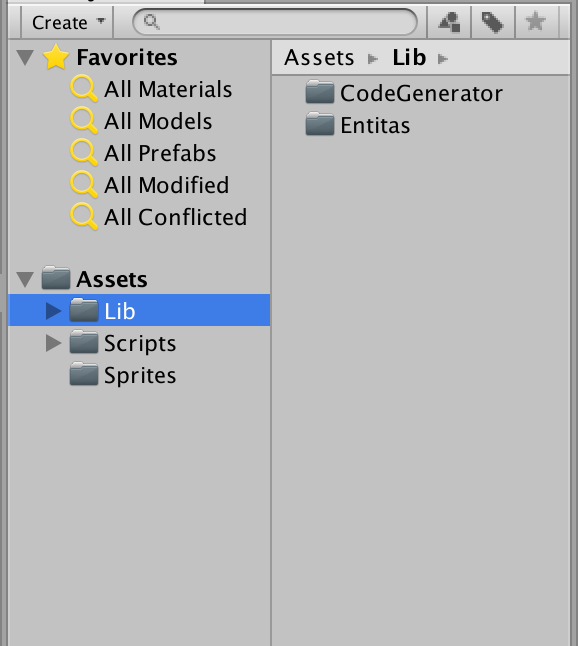
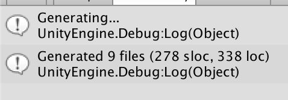

# ECS 架构概述

作者：C.y.

Github：https://github.com/yangruihan

## 0x00 何为ECS架构

***ECS***，即 Entity-Component-System（实体-组件-系统） 的缩写，其模式遵循[组合优于继承](https://en.wikipedia.org/wiki/Composition_over_inheritance)原则，游戏内的每一个基本单元都是一个**实体**，每个**实体**又由一个或多个**组件**构成，每个**组件**仅仅包含代表其特性的数据（即在组件中没有任何方法），例如：移动相关的组件`MoveComponent`包含速度、位置、朝向等属性，一旦一个实体拥有了`MoveComponent`组件便可以认为它拥有了移动的能力，**系统**便是来处理拥有一个或多个相同**组件**的**实体**集合的工具，其只拥有行为（即在系统中没有任何数据），在这个例子中，处理移动的**系统**仅仅关心拥有移动能力的**实体**，它会遍历所有拥有`MoveComponent`**组件**的**实体**，并根据相关的数据（速度、位置、朝向等），更新实体的位置。

**实体**与**组件**是一个一对多的关系，**实体**拥有怎样的能力，完全是取决于其拥有哪些**组件**，通过动态添加或删除**组件**，可以在（游戏）运行时改变**实体**的行为。

## 0x01 ECS基本结构

一个使用ECS架构开发的游戏基本结构如下图所示：


先有一个World，它是**系统**和**实体**的集合，而**实体**就是一个ID，这个ID对应了**组件**的集合。**组件**用来存储游戏状态并且没有任何行为，**系统**拥有处理**实体**的行为但是没有状态。

## 0x02 详解ECS中实体、组件与系统 

### 1. 实体

实体只是一个概念上的定义，指的是存在你游戏世界中的一个独特物体，是一系列组件的集合。为了方便区分不同的实体，在代码层面上一般用一个ID来进行表示。所有组成这个实体的组件将会被这个ID标记，从而明确哪些组件属于该实体。由于其是一系列组件的集合，因此完全可以在运行时动态地为实体增加一个新的组件或是将组件从实体中移除。比如，玩家实体因为某些原因（可能陷入昏迷）而丧失了移动能力，只需简单地将移动组件从该实体身上移除，便可以达到无法移动的效果了。


**样例**：

- Player(Position, Sprite, Velocity, Health)
- Enemy(Position, Sprite, Velocity, Health, AI)
- Tree(Position, Sprite)

*注：括号前为实体名，括号内为该实体拥有的组件*


### 2. 组件

一个组件是一堆数据的集合，可以使用C语言中的结构体来进行实现。它没有方法，即不存在任何的行为，只用来存储状态。一个经典的实现是：每一个组件都继承（或实现）同一个基类（或接口），通过这样的方法，我们能够非常方便地在运行时动态添加、识别、移除组件。每一个组件的意义在于描述实体的某一个特性。例如，`PositionComponent`（位置组件），其拥有`x`、`y`两个数据，用来描述实体的位置信息，拥有`PositionComponent`的实体便可以说在游戏世界中拥有了一席之地。当组件们单独存在的时候，实际上是没有什么意义的，但是当多个组件通过系统的方式组织在一起，才能发挥出真正的力量。同时，我们还可以用空组件（不含任何数据的组件）对实体进行标记，从而在运行时动态地识别它。如，`EnemyComponent`这个组件可以不含有任何数据，拥有该组件的实体被标记为“敌人”。


根据实际开发需求，这里还会存在一种特殊的组件，名为 **Singleton Component （单例组件）**，顾名思义，单例组件在一个上下文中有且只有一个。具体在什么情况下使用下文系统一节中会提到。 


**样例**：

- PositionComponent(x, y)
- VelocityComponent(X, y)
- HealthComponent(value)
- PlayerComponent()
- EnemyComponent()

*注：括号前为组件名，括号内为该组件拥有的数据*


### 3. 系统

理解了实体和组件便会发现，至此还未曾提到过游戏逻辑相关的话题。系统便是ECS架构中用来处理游戏逻辑的部分。何为系统，一个系统就是对拥有一个或多个相同组件的实体集合进行操作的工具，它只有行为，没有状态，即不应该存放任何数据。举个例子，游戏中玩家要操作对应的角色进行移动，由上面两部分可知，角色是一个实体，其拥有位置和速度组件，那么怎么根据实体拥有的速度去刷新其位置呢，`MoveSystem`（移动系统）登场，它可以得到所有拥有位置和速度组件的实体集合，遍历这个集合，根据每一个实体拥有的速度值和物理引擎去计算该实体应该所处的位置，并刷新该实体位置组件的值，至此，完成了玩家操控的角色移动了。

注意，我强调了移动系统可以得到**所有**拥有位置和速度组件的实体集合，因为一个实体同时拥有位置和速度组件，我们便认为该实体拥有移动的能力，因此移动系统可以去刷新每一个符合要求的实体的位置。这样做的好处在于，当我们玩家操控的角色因为某种原因不能移动时，我们只需要将速度组件从该实体中移除，移动系统就得不到角色的引用了，同样的，如果我们希望游戏场景中的某一个物件动起来，只需要为其添加一个速度组件就万事大吉。

一个系统关心实体拥有哪些组件是由我们决定的，通过一些手段，我们可以在系统中很快地得到对应实体集合。

上文提到的  **Singleton Component （单例组件）** ，明白了系统的概念更容易说明，还是玩家操作角色的例子，该实体速度组件的值从何而来，一般情况下是根据玩家的操作输入去赋予对应的数值。这里就设计到一个新组件`InputComponent`（输入组件）和一个新系统`ChangePlayerVelocitySystem`（改变玩家速度系统），改变玩家速度系统会根据输入组件的值去改变玩家速度，假设还有一个系统`FireSystem`（开火系统），它会根据玩家是否输入开火键进行开火操作，那么就有 2 个系统同时依赖输入组件，真实游戏情况可能比这还要复杂，有无数个系统都要依赖于输入组件，同时拥有输入组件的实体在游戏中仅仅需要有一个，每帧去刷新它的值就可以了，这时很容易让人想到单例模式（便捷地访问、只有一个引用），同样的，单例组件也是指整个游戏世界中有且只有一个实体拥有该组件，并且希望各系统能够便捷的访问到它，经过一些处理，在任何系统中都能通过类似`world->GetSingletonInput()`的方法来获得该组件引用。

系统这里比较麻烦，还存在一个常见问题：由于代码逻辑分布于各个系统中，各个系统之间为了解耦又不能互相访问，那么如果有多个系统希望运行同样的逻辑，该如何解决，总不能把代码复制 N 份，放到各个系统之中。**UtilityFunction**（实用函数） 便是用来解决这一问题的，它将被多个系统调用的方法单独提取出来，放到统一的地方，各个系统通过 **UtilityFunction** 调用想执行的方法，同系统一样， **UtilityFunction** 中不能存放状态，它应该是拥有各个方法的纯净集合。


**样例**：

- MoveSystem(Position, Velocity)
- RenderSystem(Position, Sprite)

*注：括号前为系统名，括号内为该系统关心的组件集合*

## 0x03 ECS架构实战

接下来终于到了实战环节，这里笔者使用 Unity3d 游戏引擎（5.6.3p4），配合现成的 [Entitas](https://github.com/sschmid/Entitas-CSharp) 框架来实现一个小 Demo。由于 Unity3d 游戏引擎已经为我们提供了输入类和物理引擎，因此 Demo 中有部分内容可能与上文不太一致，主要以展示整体架构为主，请读者忽略这些细节。

### 1. Entitas介绍

> Entitas is a super fast Entity Component System Framework (ECS) specifically made for C# and Unity. Internal caching and blazing fast component access makes it second to none. Several design decisions have been made to work optimal in a garbage collected environment and to go easy on the garbage collector. Entitas comes with an optional code generator which radically reduces the amount of code you have to write and [makes your code read like well written prose.](https://cleancoders.com/)

以上是 Entitas 官方介绍，简单来说该框架提供了代码生成器，只需要按照它的规范实现组件和系统，便可以一键生成我们需要的属性和方法，同时为了方便我们在系统中获得感兴趣的组件，它还提供了强大的分组、匹配功能。多说无益，直接开始实战吧。


### 2. 实战

下载[Unity3d游戏引擎](https://store.unity.com/cn)的步骤这里就省略了，我们先从 [Github](https://github.com/sschmid/Entitas-CSharp/releases) 上下载 Entitas，笔者这里使用的是 [Entitas 0.42.4](https://github.com/sschmid/Entitas-CSharp/releases/tag/0.42.4) 。下载好解压后，将其 CodeGenerator 和 Entitas 目录导入到一个新的 Unity 工程（这里一切从简，创建了一个空的 2D 项目），如下图所示。



接着，在工具栏找到 Tools -> Entitas ->Preference 对 Entitas 进行配置，由于这只是一个演示 ECS架构的小 Demo，就不对各种配置项进行解释了，对这些感兴趣的同学可以去官网查看文档，配置如下：


点击绿色按钮 Generate，如果没有任何报错，则配置没有问题。接下来就可以开始写代码了。

我们 Demo 第一个目标是控制一个矩形进行上下左右移动。由上文可知，我们至少需要 2 个组件：`PositionComponent`和`VelocityComponent`。在 Scripts/Components 目录下分别新建这两个脚本：

```
// PositionComponent.cs
using Entitas;
using UnityEngine;

public class PositionComponent : IComponent
{
    public Vector2 Value;
}
```

```
// VelocityComponent.cs
using Entitas;
using UnityEngine;

public class VelocityComponent : IComponent {
    public Vector2 Value;
}
```

由于在我们 Demo 中，玩家只能操控一个矩形，我们需要对其进行标记，告诉系统这个实体是玩家的代表，于是我们还要加上一个`PlayerComponent`来进行标记。

```
// PlayerComponent.cs
using Entitas;

public class PlayerComponent : IComponent { }
```

它不需要任何数据，仅仅用自身就可以实现标记的效果，拥有该组件的实体便是我们玩家控制的代表了。

实现完这 3 个组件后，我们需要利用 Entitas 框架提供的代码生成器，生成一下相应的代码，Tools -> Entitas -> Generate 或者快捷键`control + shift + g`。



没有看到任何报错，很好我们继续。

接着我们要实现`ChangeVelocitySystem`，它会根据用户`w`、`a`、`s`、`d`输入来改变